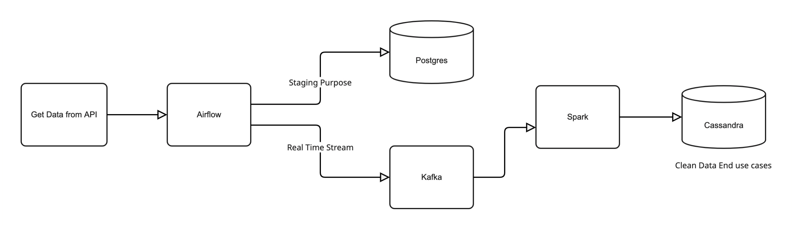
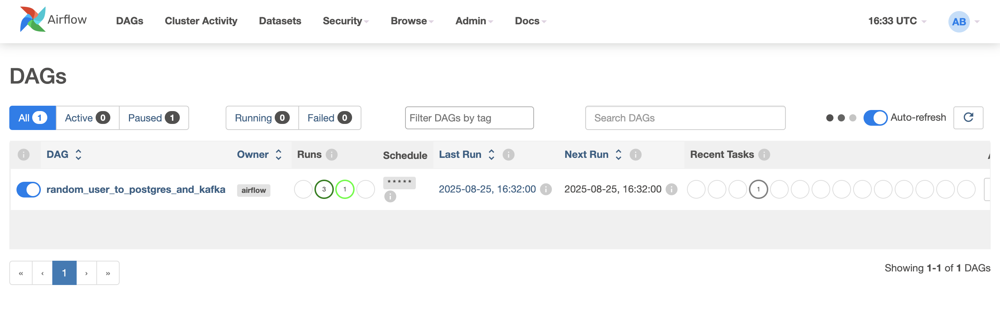
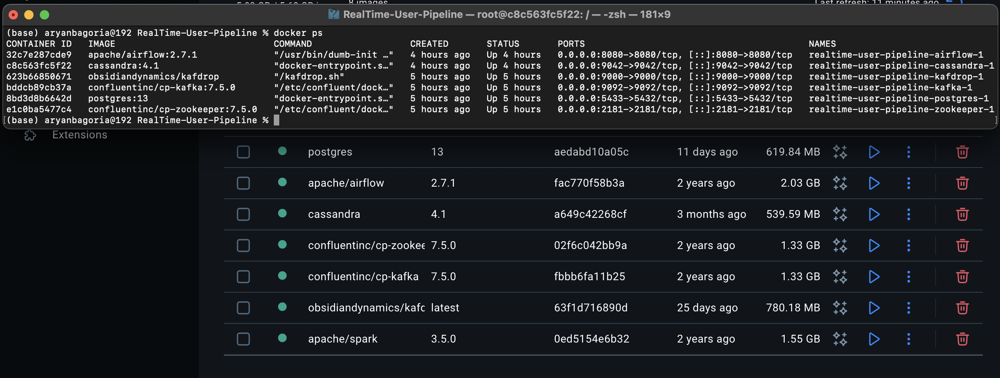
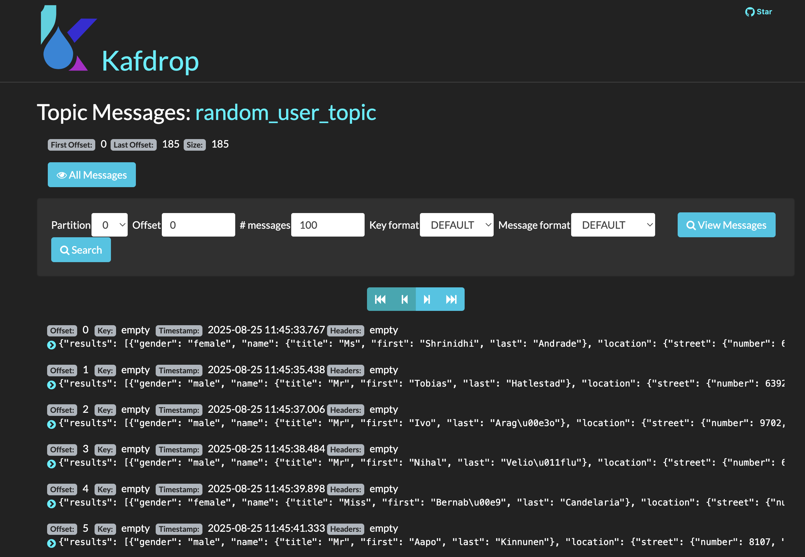
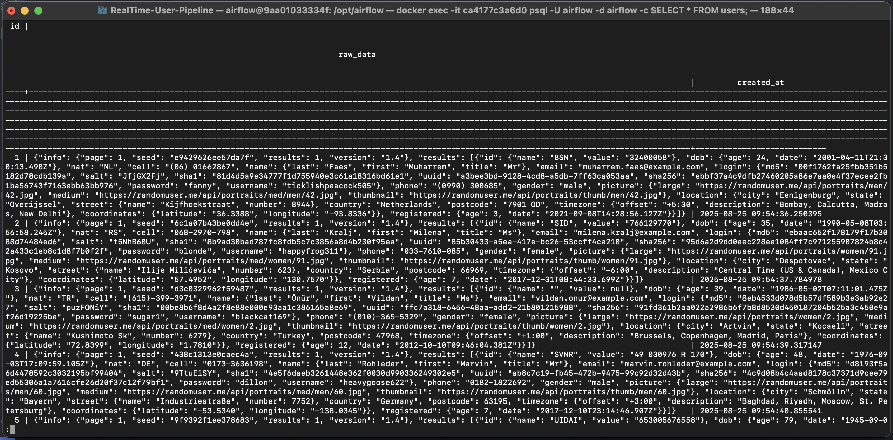
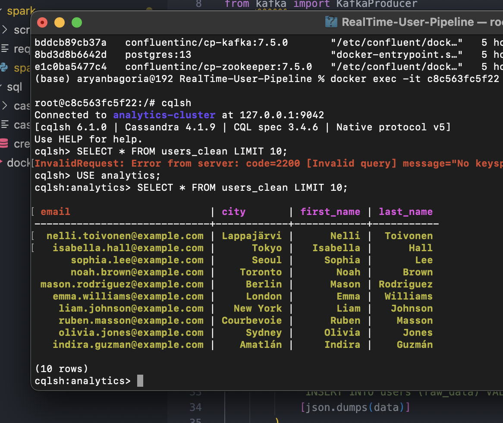

# Real-Time Data Processing with Airflow, Kafka, and Spark
  
## Project Overview
This project demonstrates a **real-time data processing pipeline** using [Airflow](https://airflow.apache.org/), [Kafka](https://kafka.apache.org/), and [Spark](https://spark.apache.org/).  
It fetches data from the [Random User Generator API](https://randomuser.me/) and processes it from raw messy data to **clean, structured data** stored in [Cassandra](http://cassandra.apache.org/) for analytics and reporting.

The pipeline involves:

1. **Data Extraction**: Airflow DAGs extract data from the API periodically.  
2. **Staging Area**: Raw data in JSON format is stored in [PostgreSQL](https://www.postgresql.org/) as a staging area.  
3. **Real-Time Streaming**: Kafka streams the data in real time to the Spark cluster.  
4. **Data Cleaning & Transformation**: Spark jobs process, clean, and transform the data.  
5. **Final Storage**: Cleaned and transformed data is stored in Cassandra for analytics and downstream applications.

---

## Architecture

The architecture consists of:

- **Airflow**: Orchestrates the pipeline and manages scheduling using DAGs.  
  

- **Docker Containers**: Containers used for Airflow, Kafka, Spark, Postgres, and Cassandra.  
  

- **Overall Architecture**: Shows the flow from API → Airflow → Postgres → Kafka → Spark → Cassandra.  
  

- **Kafka Streaming**: Handles real-time streaming of data to Spark.  
  

- **Raw Messy Data in Postgres**: JSON data stored temporarily in PostgreSQL.  
  

- **Clean Data in Cassandra**: Structured and clean data ready for analytics.  
  

---

## Features

- Real-time data ingestion from APIs  
- Messy JSON data handling and staging  
- Stream processing with Kafka and Spark  
- Cleaned and structured data storage in Cassandra  
- Fully automated pipeline using Airflow DAGs  

---

## Technologies Used

- [Python](https://www.python.org/)  
- [Apache Airflow](https://airflow.apache.org/)  
- [Apache Kafka](https://kafka.apache.org/)  
- [Apache Spark](https://spark.apache.org/)  
- [PostgreSQL](https://www.postgresql.org/)  
- [Cassandra](http://cassandra.apache.org/)
- [Docker](https://www.docker.com/community/)  

---

